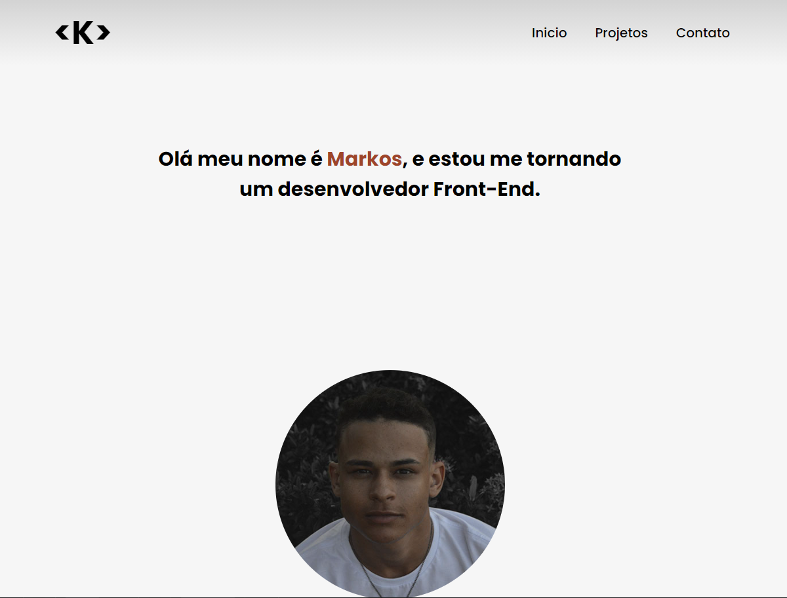
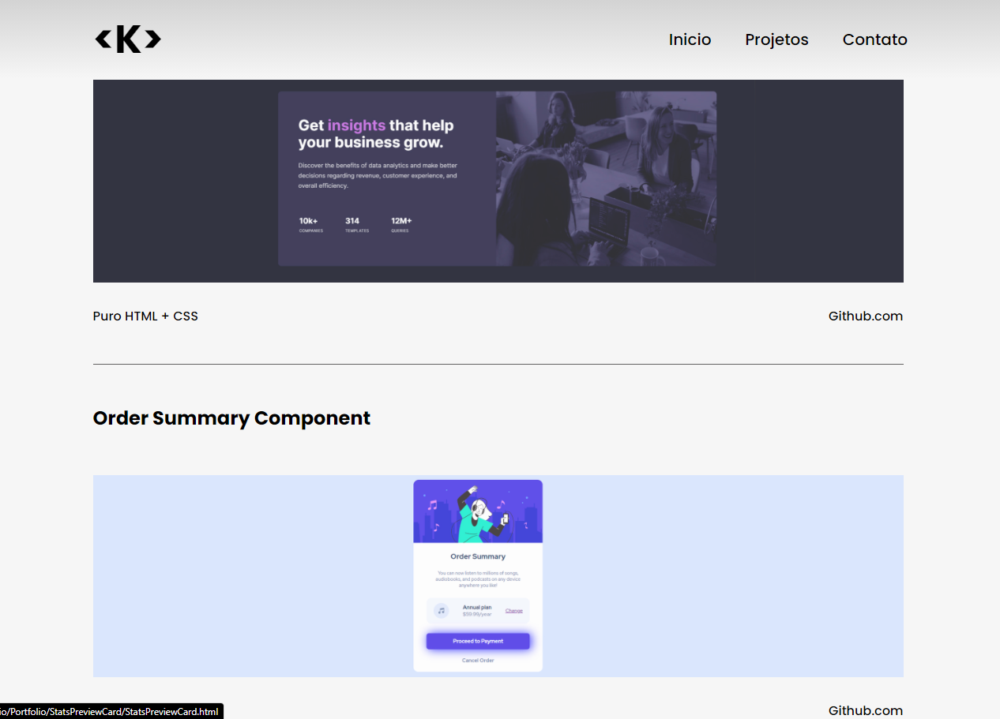
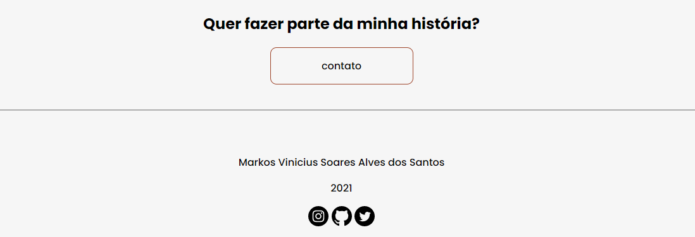
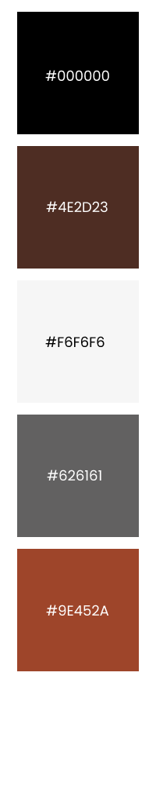

# Portfólio pessoal

Este é o meu portfólio pessoal desenvolvido com objetivo de apresentar e registrar minha evolução com desenvolvimento Front-End.

## Tabela de conteúdos

- [Visão Geral](#visao-geral)
  - [Metas](#metas)
  - [Capturas de Tela](#capturas-de-tela)
  - [Paleta de cores](#paleta-de-cores)
  - [Links](#links)
- [Meu processo](#meu-processo)
  - [Feito Com](#feito-com)
  - [O Que Estou Aprendendo](#o-que-estou-aprendendo)
  - [Linha Do Tempo](#linha-do-tempo)
- [Author](#autor)
- [Considerações Finais](#considerações-finais)
- [Mensagem Final](#mensagem-final)

## Visao Geral

### Metas

Construir um portfólio visando a experiência do usuário e a boa utilização das ferramentas de busca.

🔴 - À iniciar
🟠 - Ainda em inicio
🟡 - Em progresso/aprendendo
🟢 - Concluido/Aprimorando

- Botões interativos. 🟢
- Sobreposição de elemtos. 🟠
- Animações dinâmicas em CSS. 🟡
- Animações dinâmicas em JS. 🔴
- Boas práticas de SEO. 🔴
- Utilização de recursos alternativos do HTML. 🟡
- Responsividade em dispositivos móveis 🔴

### Capturas de tela


Inicio



Projetos




Rodapé




### Paleta de cores



### Links

- Link do site: [clique para acessar](https://markoscomk.github.io/Portfolio/index.html)

## Meu processo

### Feito com

- HTML5 semântico
- CSS3
- Flexboxes
- Desktop first
- Figma

### O que estou aprendendo


Estou melhorando minha organização de pastas e minha organização de código CSS, assim como melhoria no conteúdo dos comentários e na nomeação das Div's, id's e names.

Sempre progredindo.

Abaixo alguns códigos usados no portfólio.

```css
#instagram:hover{
    fill: #9E452A;
}

#github:hover{
    fill: #9E452A;
}

#twitter:hover{
    fill: #9E452A;
}

.contact-button:hover{
    cursor: pointer;
    background: #9E453A;
    color: #FFF;
}
```


### linha do tempo

Este site teve início em 05 de setembro de 2021 e está em progresso


## Autor

- Github - [MarkosComK](https://github.com/MarkosComK)
- Frontend Mentor - [@MarkosComK](https://www.frontendmentor.io/profile/MarkosComK)
- Instagram - [@MarkosComK](https://www.instagram.com/markoscomk/)
- Twitter - [@MarkosComK](https://twitter.com/markoscomk)

## Considerações finais

Se você quiser me dar algum feedback, dica, conselho, sinta-se à vontade em falar comigo através de qualquer uma de minhas redes sociais

## Mensagem final

Tudo acontece por uma razão e esta existe para me[/te] ajudar.😎

<br>

<div>
  <a href="https://instagram.com/MarkosComK" target="_blank"></a>
  <a href="https://twitter.com/markoscomk" target="_blank"></a>
 <a href = "mailto:markoscomks@gmail.com"></a>
</div>

<br>